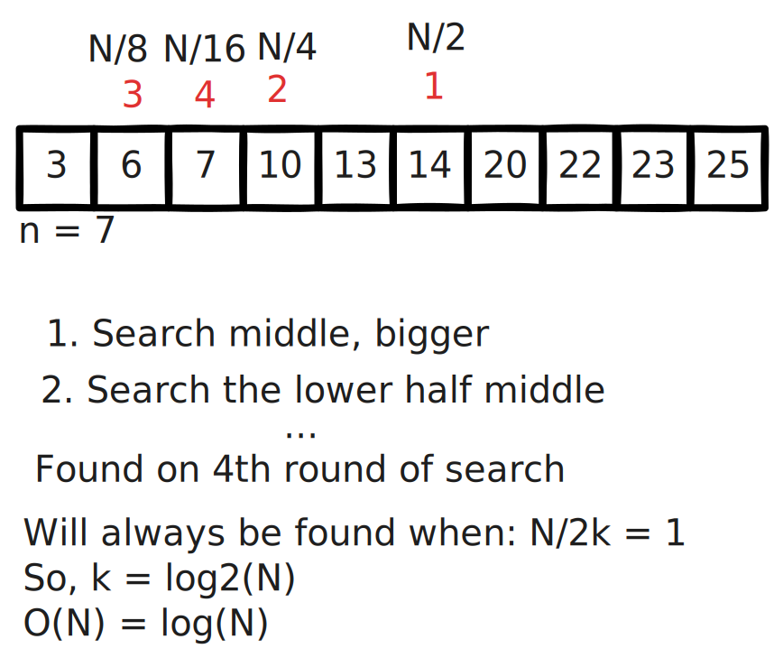
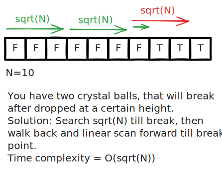
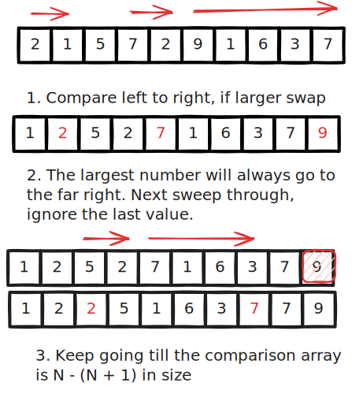
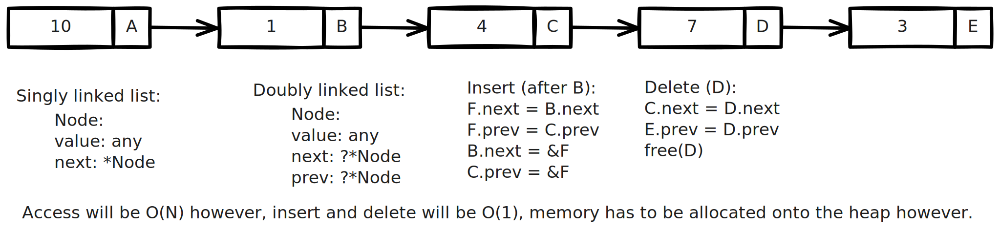

# Data Structures

My goal here is to learn data structures, as well as Zig, from [ThePrimeagen's course The Last Algorithms Course You'll Need](https://frontendmasters.com/courses/algorithms/).

## Algorithms

### Linear Search

Nothing much to say here. You keep scanning through each value of the array until you get to your value.

### Binary Search

### Two Crystal Balls Problem

### Bubble Sort

### Linked Lists

